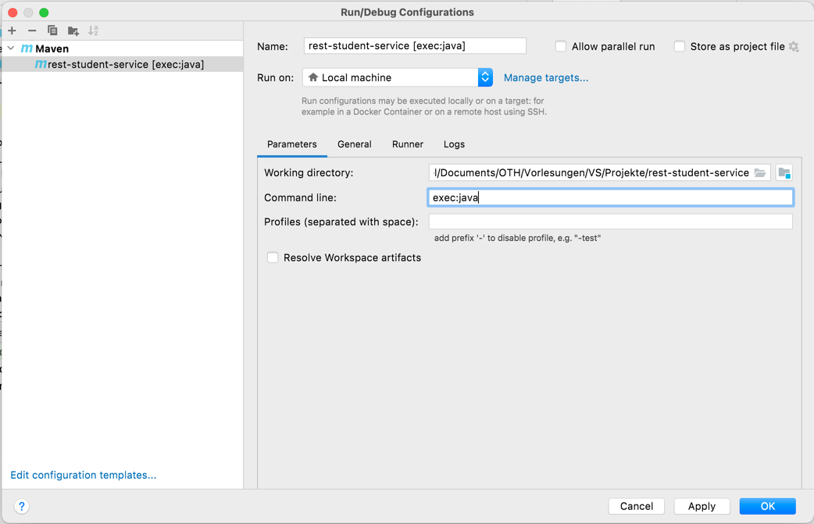

# Verteilte Systeme: RESTful Webservices

Dieses Projekt dient als Lösungsvorschlag für die Übung 7.
Ausgangslage für die Übung 8 ist Ihre Lösung zur Übung 7, das heißt, Sie verwenden Ihr bisheriges Projekt einfach weiter.
Alternativ können Sie auch dieses Projekt "clonen" und darauf weiter aufbauen.

## Starten des Projekts

Um dieses Projekt ohne Fehler ausführen zu können, müssen Sie eine neue **Run Configuration** hinzufügen (über *Run* > *Edit Configurations...*). 

Wählen Sie dort über das **+** eine *Maven Configuration* aus und tragen Sie in *Command line* entsprechend dem Screenshot `exec:java` ein.

Anschließend können Sie Ihr Projekt über den grünen Play-Button starten.